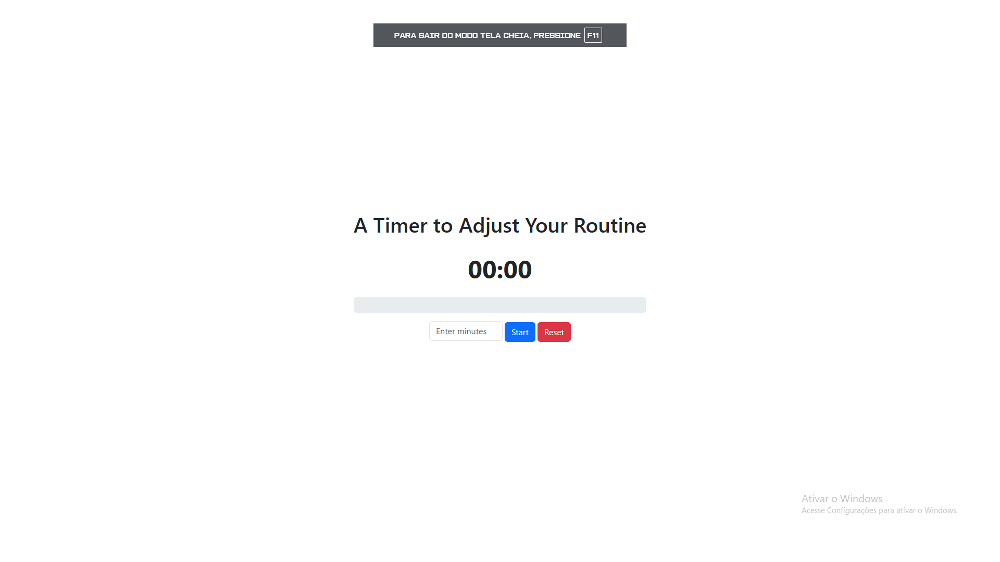

# 🕒 Routine Timer

A simple and responsive web timer built with **HTML**, **CSS**, **Bootstrap**, and **JavaScript**. This project allows users to input a number of minutes and start a countdown to help manage and adjust daily routines.

## 📸 Preview

![Routine Timer Preview] ()

## 🚀 Features

- Responsive layout using **Bootstrap**
- Customizable countdown timer
- Alerts when the timer finishes
- Reset functionality

## 🛠️ Technologies Used

- HTML5
- CSS3
- Bootstrap 5
- JavaScript (vanilla)

## 🔧 How to Use

1. Clone or download this repository:
   ```bash
   git clone https://github.com/AlessandroFTunes/Timer-bootstrap.git
